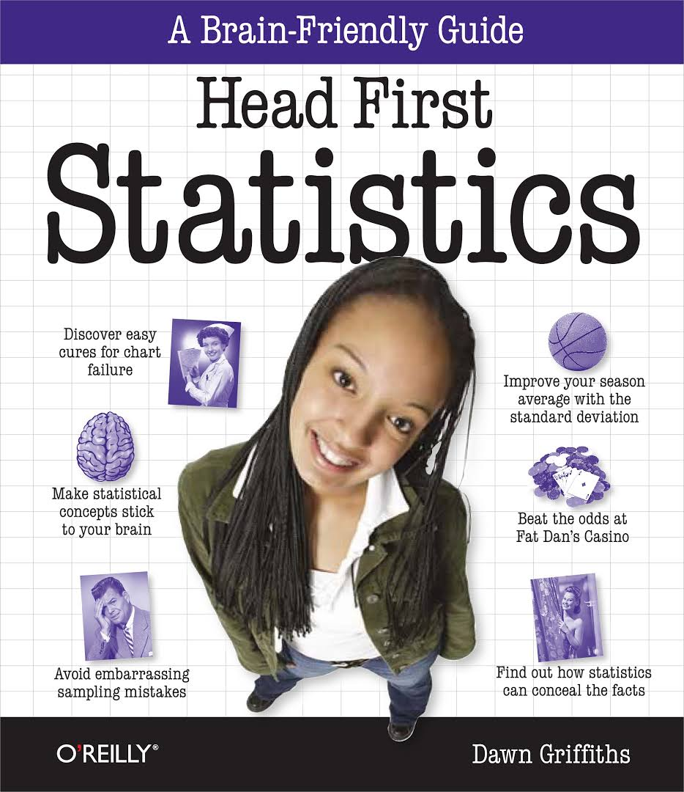

## Head First Statistics

### Contents
- Chapter01 정보의 시각화 : 첫인상
- Chapter02 중심적 경향 측정하기 : 중도를 지키세요
- Chapter03 변이와 분포 측정하기 : 강력한 범위
- Chapter04 확률 계산하기 : 위험을 무릅쓰기
- Chapter05 이산확률분포 사용하기 : 기대수준을 관리하세요
- Chapter06 순열과 조합 : 약속 정하기
- Chapter07 기하, 이항, 푸아송분포 : 사물을 분산시키세요
- Chapter08 정규분포 사용하기1 : 정상적으로 되기
- Chapter09 정규분포 이용하기2 : 정상을 넘어서
- Chapter10 통계 표본 사용하기 : 표본 고르기
- Chapter11 모집단과 표본 추정하기 : 예측하기
- Chapter12 신뢰구간 구성하기 : 신뢰를 갖고 추측하기
- Chapter13 가설검정 이용하기 : 증거를 보세요
- Chapter14 카이제곱분포 : 무슨일이 일어나고 있습니다..
- Chapter15 상관과 회귀 : 내 라인은 무엇일까요?
- 부록1 10가지 중요한 이야기 (지금까지 설명하지 않은)
- 부록2 통계 테이블
